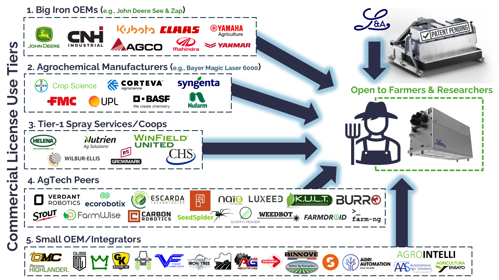

<h1 align="center"><strong>L&amp;ASER</strong></h1>

<p align="center">
  <a href="https://huggingface.co/Laudando-Associates-LLC">
    
  </a>
</p>

## A laser weeder for all farmers, big and small

This repository contains open-source releases of the L&Aser.

<div align="center">
  <p>
    <a href="https://www.laudando.com/fight" target="_blank">Click here to join the fight!</a>
  </p>
</div>

<p align="center" style="margin: 0; padding: 0;">
  
</p>

<p align="center" style="margin: 0; padding: 0;">
  
</p>

The Dual Licensing can be viewed [here](LAser_Dual_Licensing_Summary_4_20_25.pdf).

## Updates

- [x] **(2025-05-18)** Update [Alpha Perception](software/alpha/alpha_perception/) to Gen 2
- [x] **(2025-05-14)** Add [Alpha Training](software/alpha/alpha_training/)
- [x] **(2025-05-03)** Add [Alpha Perception](software/alpha/alpha_perception/)

## Setup

```bash
git clone --recursive https://github.com/Laudando-Associates-LLC/LASER.git
```

OR 

```bash
git clone --recursive git@github.com:Laudando-Associates-LLC/LASER.git
```

## License
This software is released under the [L&Aser Public Use License (Based on SSPL v1)](LICENSE), copyright © 2025
Laudando & Associates LLC. 

The L&A Pucks Dataset use [L&Aser Dataset Replication License (Version 1.0)](https://huggingface.co/datasets/Laudando-Associates-LLC/pucks/blob/main/LICENSE).

The L&A Pucks ROS 2 Dataset use [L&Aser Dataset Replication License (Version 1.0)](https://huggingface.co/datasets/Laudando-Associates-LLC/pucks-ros2/blob/main/LICENSE).

Please note:

  * Commercial use requires a separate license.

  * AgCeption™ branded systems and L&Aser Beta modules are not covered under this license.


## Contact
For general questions or bug reports, please open an issue.