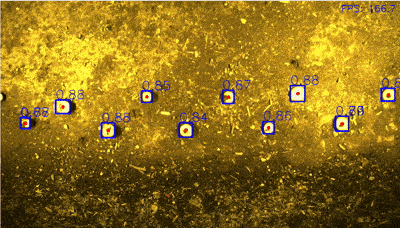
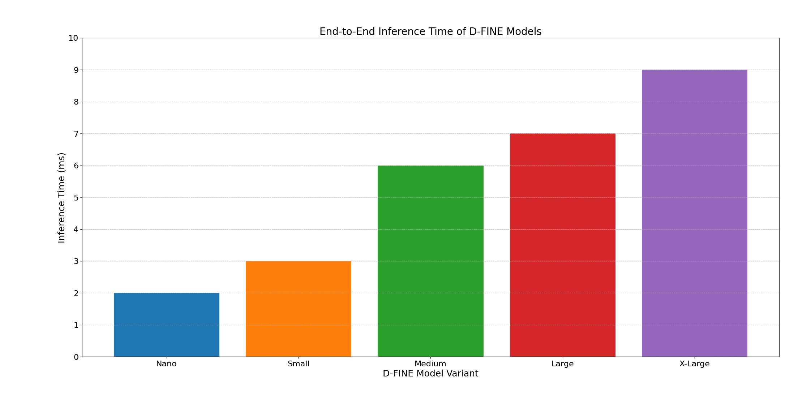

<h1 align="center"><strong>Alpha Perception</strong></h1>

<div align="justify">

Alpha Perception (Gen 2) is a perception system developed for the L&Aser module. It enables low-latency inference using TensorRT (FP16) along with minimal Host (CPU) to Device (GPU) copies for an end to end inference. This repository serves as a strong foundation for academic researchers or independent developers interested in high-performance field robotics.

</div>

> *Refactored in May 2025 for compatibility with the latest NVIDIA CUDA libraries, along with some basic CUDA kernels.*


<p align="center" style="margin: 0; padding: 0;">
  
</p>

---

## Tested Configuration

| Component       | Version                                   |
|----------------|-------------------------------------------|
| **Ubuntu**      | 24.04                                     |
| **GPU**         | NVIDIA RTX A6000   |
| **CUDA**        | 12.8                                      |
| **Environment** | Docker container with GPU access          |

> *The container requires modification for compatibility with integrated GPUs such as NVIDIA Jetson.*

---

## Setup

Available datasets and models can be downloaded from our [Hugging Face](https://huggingface.co/Laudando-Associates-LLC) page.

```bash
bash start_container.sh
python src/alpha_perception/scripts/download_bag.py
python src/alpha_perception/scripts/download_models.py
```

> The ROS 2 bag file is ~20Gb and quantising the [D-FINE](https://huggingface.co/Laudando-Associates-LLC/d-fine) neural networks is highly dependent on the [CUDA GPU Compute Capability](https://developer.nvidia.com/cuda-gpus).

## Quick Start

Once the datasets and models have been downloaded.

```bash
bash start_container.sh # or ignore if already inside
ros2 launch alpha_perception perception_demo.launch.py
```

## ROS 2 Parameter Descriptions

To view all the parameters.

```bash
ros2 launch alpha_perception perception_demo.launch.py -s
```

| Parameter       | Description                        | Default | Params                      |
|:----------------:|:------------------------------------:|:--------:|:--------------------------------------------:|
| `model_variant` | D-FINE model variant to use         | `'nano'` | One of: `'nano'`, `'small'`, `'medium'`, `'large'`, `'xlarge'` |
| `gui`           | Whether to display OpenCV GUI       | `'true'` | `'true'` or `'false'` |

Using the [Extra Large D-FINE model](https://huggingface.co/Laudando-Associates-LLC/d-fine-xlarge) without OpenCV GUI

```bash 
ros2 launch alpha_perception perception_demo.launch.py model_variant:=xlarge gui:=false
```
> The is similar to running it in Headless mode.

## ROS 2 Output Topics

| Topic Name           | Description                     | ROS 2 Msg Type          |
|:---------------------:|:----------------------------------:|:------------------------:|
| `/alpha_perception/detections` | Custom Msg having 2D detection info     | `alpha_perception/msg/DetectionArray` |
| `/alpha_perception/inference_time` | Inference time in ms from reading the input camera stream to publishing the `DetectionArray` msg | `std_msgs/msg/Int16` |


## Metrics

The inference time has been measured from the input caemra frame to publishing the `DetectionArray` message in ROS 2, so this encompasses the preprocessing, forward pass and postprocessing.

<p align="center" style="margin: 0; padding: 0;">
  
</p>

> All tests were carried out with `gui:=false` and on a RTX A6000, ROS 2 message overhead is dependent on the hardware CPU.

## License
The D-FINE models use [Apache License 2.0](https://github.com/Peterande/D-FINE/blob/master/LICENSE).

The L&A Pucks ROS 2 Dataset use [L&Aser Dataset Replication License (Version 1.0)](https://huggingface.co/datasets/Laudando-Associates-LLC/pucks-ros2/blob/main/LICENSE).

The L&Aser is released under the [L&Aser Public Use License (Based on SSPL v1)](LICENSE), copyright © 2025 Laudando & Associates LLC.

Please note:

  * Commercial use requires a separate license.

  * AgCeption™ branded systems and L&Aser Beta modules are not covered under this license.

## Contact
For general questions or bug reports, please open an issue.

For specific inquiries, contact:
[hari@laudando.com](mailto:hari@laudando.com)

## Citation
If you use `D-FINE` or its methods in your work, please cite the following BibTeX entries:
```latex
@misc{peng2024dfine,
      title={D-FINE: Redefine Regression Task in DETRs as Fine-grained Distribution Refinement},
      author={Yansong Peng and Hebei Li and Peixi Wu and Yueyi Zhang and Xiaoyan Sun and Feng Wu},
      year={2024},
      eprint={2410.13842},
      archivePrefix={arXiv},
      primaryClass={cs.CV}
}
```