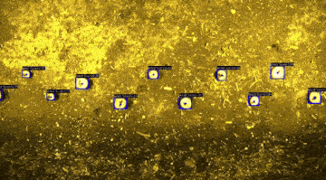

<h1 align="center"><strong>Alpha Perception</strong></h1>

<div align="justify">

Alpha Perception is the legacy perception system developed for the Alpha version of the L&Aser module. It enables low-latency inference using TensorRT (FP32), and serves as a strong foundation for academic researchers or independent developers interested in high-performance field robotics.

</div>

> *This code is no longer in use at Laudando & Associates LLC due to limitations in inference speed and lack of cross-modal perception support.*  

> *Refactored in May 2025 for compatibility with the latest NVIDIA CUDA libraries. Last field-tested in early 2024.*


<p align="center" style="margin: 0; padding: 0;">
  
</p>

---

## Tested Configuration

| Component       | Version                                   |
|----------------|-------------------------------------------|
| **Ubuntu**      | 24.04                                     |
| **GPU**         | NVIDIA RTX A6000 / RTX 4090 Laptop GPU    |
| **CUDA**        | 12.8                                      |
| **Environment** | Docker container with GPU access          |

> *The container requires modification for compatibility with integrated GPUs such as NVIDIA Jetson.*

---

## Quick Start

If you already have a trained neural network capable of object localization, Alpha Perception provides a low-latency inference pipeline that significantly outperforms frameworks such as PyTorch, TorchScript, TensorFlow, TensorFlow Lite, or raw ONNX.

TensorRT engines must be generated from an ONNX model.

```bash
bash start_container.sh
ros2 run alpha_perception perception
```

## Metrics

In early 2024 field testing, Alpha Perception achieved inference latencies of ~37 ms on the NVIDIA Jetson AGX Orin 64GB Developer Kit running JetPack 5.1.2.

## License
This software is released under the [L&Aser Public Use License (Based on SSPL v1)](LICENSE), copyright © 2025
Laudando & Associates LLC.

Please note:

  * Commercial use requires a separate license.

  * AgCeption™ branded systems and L&Aser Beta modules are not covered under this license.

## Contact
For general questions or bug reports, please open an issue.

For specific inquiries, contact:
[hari@laudando.com](mailto:hari@laudando.com)